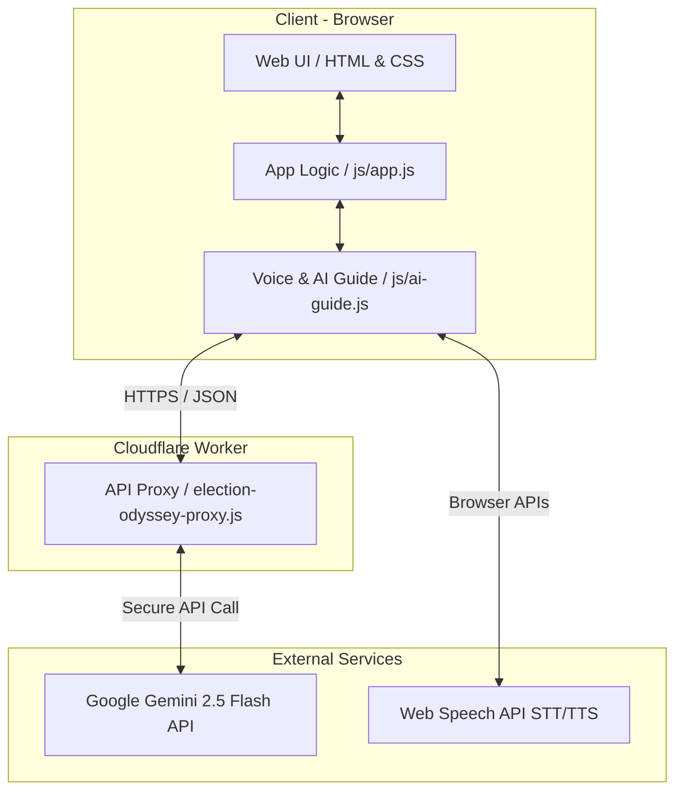

# Election Odyssey (India Edition)

> An intelligent Election Guide for India. Powered by Gemini 2.5 Flash, it maps user personas (First-Time, NRI) to generate dynamic election timelines and proactive conversational nudges.

Election Odyssey is an AI-powered, proactive web application designed to guide Indian voters through the complex electoral process. It acts as a personalized digital assistant tailored to align with the guidelines of the Election Commission of India (ECI), transforming the bureaucratic process of voter registration into an engaging, accessible, and highly personalized journey.

## ✨ Features

- **Intelligent Persona Mapping**: Automatically categorizes users into specific voter profiles:
  - **First-Time Voters (FTV)**: Guidance on initial registration (Form 6).
  - **Non-Resident Indians (NRI)**: Navigating overseas voting procedures.
  - **Shifted Voters (SV)**: Transferring voting constituencies (Form 8).
  - **Election Volunteers (BLO)**: Tools and info for Booth Level Officers.
  - **Experienced Voters (EV)**: General tracking for upcoming elections.
- **Dynamic ECI Timelines**: Generates dynamic milestones (Form 6, EPIC card tracking, EVM/VVPAT familiarization) based on the mapped persona and election dates.
- **Proactive AI Guide**: Powered by Google's **Gemini 2.5 Flash**, the AI remembers chat history, recognizes user personas, and proactively offers contextual nudges and non-partisan electoral guidance.
- **Voice & Multilingual Support**: Built-in Speech-to-Text (STT) and Text-to-Speech (TTS) capabilities. The AI can converse in an Indian-English accent and supports queries in regional languages like Hindi.
- **Secure Cloudflare Proxy**: LLM API interactions are securely routed through a Cloudflare Worker, keeping API keys hidden from the frontend client.

## 🛠️ Tech Stack

- **Frontend**: Vanilla HTML5, CSS3, JavaScript (ES6)
- **Backend/API Proxy**: Cloudflare Workers
- **AI/LLM**: Google Gemini 2.5 Flash
- **Testing**: Node.js (Unit Tests), Bash (Integration Tests)

## 🏗️ Architecture (High-Level Design)



## 📂 Repository Structure

```text
election-odyssey-web/
├── css/                  # Application styles
├── js/                   # Core application logic
│   ├── app.js            # Main application UI and logic
│   ├── ai-guide.js       # Voice and Gemini API integration
│   └── utils.js          # Persona and Timeline generator logic
├── worker/               # Cloudflare Worker script
│   └── election-odyssey-proxy.js
├── tests/                # Automated and Manual Testing Suite
│   ├── logic_tests.js    # Node.js Unit tests for utils
│   ├── worker_tests.sh   # Bash tests for the Cloudflare API
│   └── manual_test_plan.md # UI/UX End-to-End Checklist
└── index.html            # Main Entry Point
```

## 🚀 Getting Started

### Prerequisites
- A modern web browser.
- **Node.js** (Only required for running local unit tests).

### 1. Running the Web Application
Because the frontend uses vanilla HTML/JS, you can simply serve the directory locally.
```bash
# Clone the repository
git clone https://github.com/your-username/election-odyssey.git

# Navigate to the web folder
cd election-odyssey/election-odyssey-web

# Serve using any local web server, for example:
npx serve . 
# OR
python -m http.server 8000
```
Open `http://localhost:8000` in your browser.

### 2. Testing the Application

The repository includes both automated and manual tests inside the `tests/` directory.

**Run Frontend Logic Tests (Requires Node.js):**
```bash
cd election-odyssey-web
node tests/logic_tests.js
```

**Run Backend Worker Proxy Tests:**
```bash
cd election-odyssey-web
bash tests/worker_tests.sh
```

**Manual UI Testing:**
Follow the checklist provided in `tests/manual_test_plan.md` to ensure all end-to-end frontend integrations, voice services, and AI proactivity behave as expected.

## 🔒 Security
- **API Keys**: The Gemini API key is heavily guarded inside Cloudflare Worker environment variables/secrets. It is never exposed in the client-side `app.js` or `ai-guide.js`. 

## 📜 Disclaimer
This application is designed as an educational and informational tool based on public Election Commission of India (ECI) guidelines. It is not an officially affiliated government application.
